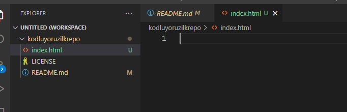

# kodluyoruzilkrepo
Kodluyoruz Eğitimi kapsamında açtığım ilk repo
Bu repo kodluyoruz [Kodluyoruz] Front-End eğitiminde oluşturduğumuz ilk repo.İçerisinde bir adet README ve bir adet de index.html barındırıyor.

#Installation
öncelikle projeyi klonlayın.Buraya sizin reponuzdan aldıgınız link gelecek

```
git clone https://github.com/ayseilkay/kodluyoruzilkrepo.git
```

# Usage

Projeyi klonladıktan sonra Visual Studio Code programında açınız
Linux için:
```
cd kodluyoruzilkrepo
code .
```
# Contributing
Pull requestler kabul edilir.Büyük değişiklikler için, lütfen önce neyi değiştirmek istediğinizi tartışmak için bir konu açınız.

# Licence
[MIT](https://choosealicense.com/licenses/mit/)

# İmage
